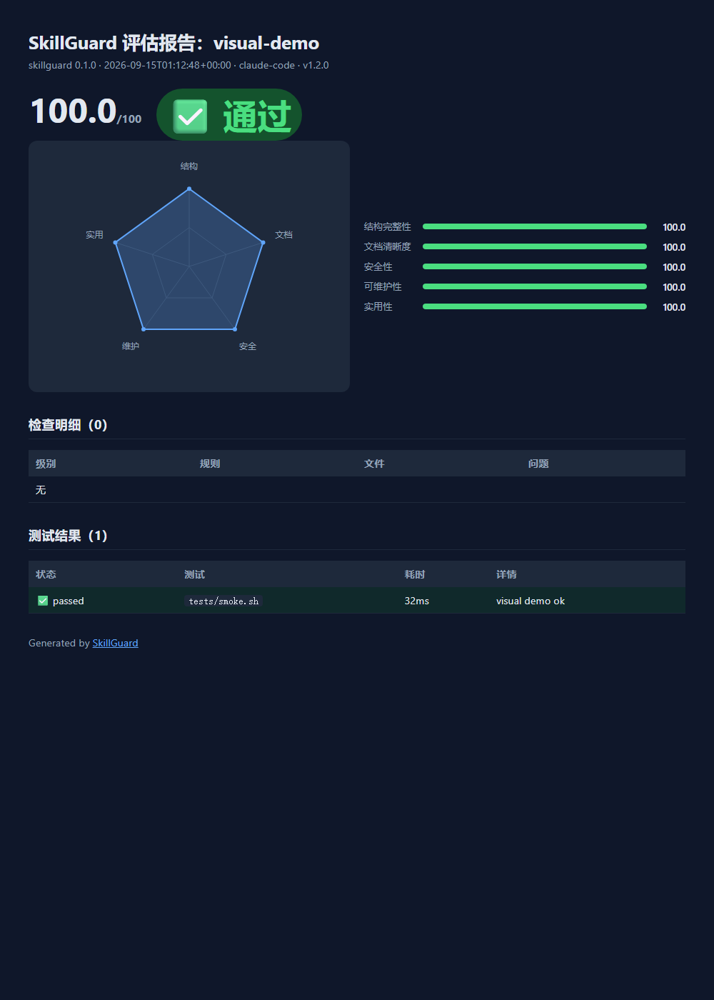

<div align="center">


# 🛡️ SkillGuard

**Agent Skills 质量保障与测试框架** — 为 Claude Code / Codex / Cursor 等 AI 编码代理的 Skills 提供静态校验、沙箱测试、质量评分与 CI 集成。

[](README.en.md) [](README.md)

[](https://www.python.org/)
[](LICENSE)
[](https://github.com/la2278647-arch/skillguard)
[](https://github.com/astral-sh/ruff)
[](SECURITY.md)
[](https://github.com/la2278647-arch/skillguard/actions)

**📊 可视化评估报告：**



</div>

---

## 📌 为什么需要 SkillGuard？

Agent Skills 生态正在爆发式增长（superpowers 28.6万★、anthropics/skills 17.6万★），但**没有任何标准工具验证一个 Skill 是否真的有效、安全、可维护**。SkillGuard 填补了这个空白：

- 🔴 **发布前自测**：Skill 作者一键验证自己的作品质量
- 🛡️ **安全扫描**：自动检测危险命令（rm -rf、curl|sh、硬编码 API Key 等）
- ✅ **沙箱测试**：在隔离副本中运行测试脚本，杜绝触碰源目录
- 📊 **质量评分**：结构/文档/安全/可维护/实用五维评分 + CI 质量门禁

## ✨ 特性

| 特性 | 说明 |
|------|------|
| 🧹 **静态校验** | 结构完整性、引用完整性、325 条安全模式规则（SRC/REF/SEC/DOC） |
| 🏜️ **沙箱测试执行** | 整个 Skill 目录复制到临时目录运行测试，脚本无法触碰源文件，强制超时 |
| 🔢 **质量评分** | 五维评分模型（0-100），可配置阈值 |
| 📄 **多格式报告** | JSON（CI 消费）/ Markdown（PR 评论）/ HTML（自包含分享页） |
| 🤖 **CI 集成** | `--ci` 模式，不通过时退出码 1，一行接入 GitHub Actions |
| 🔌 **MCP 服务器** | `skillguard mcp` — AI 代理（Claude/Cursor/Codex）直接调用质量检测 |
| 📊 **聚合报告** | `skillguard report` — 团队/仓库级多 Skill 质量总览 |
| 🚀 **零依赖启动** | `skillguard init` 秒建项目骨架 + 冒烟测试 |

## 🚀 快速开始

### 安装

```bash
# 方式一：PyPI（待发布后可用）
pip install skillguard

# 方式二：GitHub Release 直接安装（当前可用，等效 PyPI）
pip install https://github.com/la2278647-arch/skillguard/releases/download/v0.5.0/skillguard-0.5.0-py3-none-any.whl
```

### 1. 初始化一个新 Skill

```bash
skillguard init my-skill --name my-skill --framework claude-code
cd my-skill
skillguard check .
```

### 2. 检查现有 Skill

```bash
# 基础检查
skillguard check path/to/skill

# 导出 HTML 报告
skillguard check path/to/skill --format html -o report.html

# CI 模式（不通过则退出码 1）
skillguard check path/to/skill --ci
```

### 3. 批量扫描目录中的全部 Skills

```bash
# 扫描当前目录树中的全部 Skill，按质量分排行
skillguard scan .

# 限制深度、只看 Top 10
skillguard scan ./skills --depth 2 --top 10
```

### 4. 生态质量基准（扫描远程仓库）

```bash
# 扫描一个 GitHub 仓库中的全部 Skills，输出生态质量报告
skillguard bench https://github.com/anthropics/skills.git

# 限制扫描量 + 导出 JSON
skillguard bench https://github.com/obra/superpowers.git --max-skills 50 --json report.json
```

### 5. 作为 Python 库使用

```python
from skillguard import SkillGuard, Config

guard = SkillGuard(Config(skill_dir="path/to/skill"))
report = guard.run()          # 完整评估
print(report.overall_score)   # 综合评分
print(report.to_json())       # JSON 报告
guard.export(report, "report.html")

# 批量扫描
for item in guard.scan_directory("./skills"):
    print(item["name"], item["score"], item["passed"])
```

## 📚 文档

- [从零构建高质量 Skill 教程](docs/tutorial.md) — 完整开发流程
- [FAQ 常见问题](docs/faq.md) — 安装/使用/安全/兼容性高频问答
- [API 文档](docs/api.md) — Python API 完整参考
- [CLI 参考](docs/cli.md) — 命令行完整参考
- [架构说明](docs/architecture.md) — 系统架构与设计决策
- [质量规则](docs/rules.md) — 全部检查规则详解
- [CI 集成指南](docs/ci.md) — GitHub Actions 接入示例

## 🏗️ 项目结构

```
skillguard/
├── skillguard/          # 核心包
│   ├── cli.py           # CLI 入口
│   ├── config.py        # 配置模型
│   ├── engine.py        # 编排引擎
│   ├── models.py        # 数据模型
│   ├── parser.py        # SKILL.md 解析
│   ├── reporting.py     # 报告生成器
│   ├── runner.py        # 沙箱测试执行器
│   ├── scoring.py       # 质量评分
│   ├── validator.py     # 静态校验引擎
│   └── version.py       # 版本
├── tests/               # 126 个测试（覆盖率 99.45%）
└── pyproject.toml
```

## 🛠️ 开发

```bash
git clone https://github.com/skillguard/skillguard.git
cd skillguard
pip install -e ".[dev]"
pytest                 # 运行测试
ruff check skillguard tests  # 代码质量
```

## 📄 许可证

[MIT](LICENSE)

## ⭐ 支持项目

如果 SkillGuard 对你有帮助，请给一个 Star ⭐ 并分享给更多开发者！


